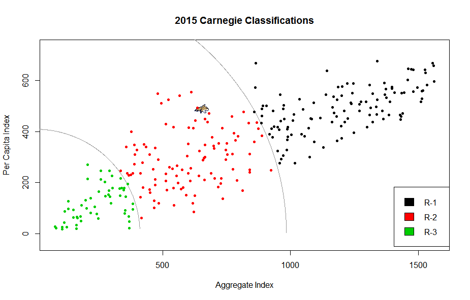
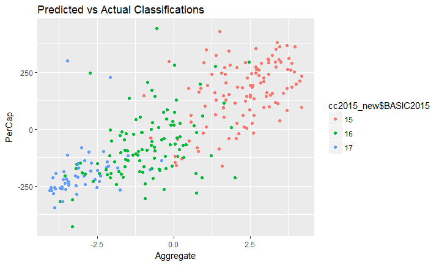

```{r setup, include=FALSE}
knitr::opts_chunk$set(echo = FALSE)
library(ggplot2)
#read in data
setwd("~/Carnegie-SEM/data")
cc2015 <- read.csv("CC2015data.csv",header = TRUE)

########2015################
cc2015.full <- read.csv("CC2015data.csv", header = TRUE, as.is = TRUE)
#updated file
#cc2015.full <- read.csv("Updated2015.csv", header = TRUE)

cc2015 <- cc2015.full[(cc2015.full$BASIC2015>14&cc2015.full$BASIC2015<18),]
cc2015$BASIC2015 <- factor(cc2015$BASIC2015)


#function for ranking the data
minrank <- function(x){rank(x, ties.method = "min")}

#dataset that we want to use
cc2015Ps<-
  na.omit(cc2015[,c("NAME","BASIC2010","BASIC2015","FACNUM","HUM_RSD","OTHER_RSD","SOCSC_RSD","STEM_RSD","PDNFRSTAFF","S.ER.D","NONS.ER.D")])

#calculate the ranked data
cc2015.r <- data.frame(cc2015Ps[,1:3],sapply(cc2015Ps[,-c(1:3)],minrank)) 

cc2015percap <- cc2015Ps[,c("PDNFRSTAFF","S.ER.D","NONS.ER.D")]/cc2015Ps$FACNUM
colnames(cc2015percap) <- c("PDNRSTAFF_PC", "S.ER.D_PC", "NONS.ER.D_PC")
cc2015percap.r<-data.frame(sapply(cc2015percap,minrank))

#sem using raw data
cc2015_new <- cbind(cc2015Ps, cc2015percap)


cc2015_r <- cbind(cc2015.r, cc2015percap.r)

```

## The Carnegie Classifications

- Based on PCA on correlation matrix of ranked institutional data
- Two Scales: Aggregate (x-axis) and Per-Capita (y-axis)
_ Three categories of PhD-granting institutions: R1 to R3

## Carnegie in 2015


## How are Scores Calculated?
The Carnegie Classifications are based on ranked data (because some schools are vastly larger on certain metrics than the rest). The ranked data are partitioned into two datasets and a PCA is generated on the both datasets. The first PC score is then used as an index for each trait. 

## Aggregate and Per-Capita Indices

The classifications are calculated based on two indices of institutional output. The first is based on a weighted average of the number of PhDs awarded by the institution; the second is based on a per-capita measurement of research expenditures and research staff. 
__Aggregate Index:__
$$Ag.Index_{i}  = HumanitiesPhD_{i} + StemPhD_{i} + SocialSciencePhD_{i}$$
$$+ OtherPhD_{i}  + StemExpenditures_{i} + NonStemExpenditures_{i} + ResearchStaff_{i} $$ 
__Per Capita Index:__ 
$$PC.Index_{i} = \frac{ResearchStaff_{i} + StemExpenditures_{i} + NonStemExpenditures_{i}}{FacultySize_{i}} $$ 


## PCA Plot - Arbitrary Boundaries

From here, the methodology of the Carnegie Classifications is to produce a plot of the two correlated indices. Lines are arbitrarily drawn to create three partitions of the space. The following plot is produced. 


## Problems with PCA
Many of the decisions made in this process are data driven and are outside the control of researchers:

+ Aggregate and Per-Capita Indices were constructed so that they are correlated, but how correlated they are can change from year to year
+ Attributes of the PCAs themselves change from year to year, meaning important policy drivers in one year might not be important in the next year (Social Science PhDs) 
+ This can affect policy decisions made based on the classifications
+ Data are rarely grouped into three neat clusters, and lines are arbitrarily drawn
+ Both PCAs throw out roughly 30 percent of the variation in underlying variables


__Because of this, we wanted to try fitting a Structural Equation Model to create an index to compete with the Carnegie Classifications__

## Structural Equation Models
__GoaL__: Model two latent traits, one for the __aggreagate scale__ and the other for the __per-capita scale__, and then use those to generate a "super-latent" single trait. 

We could then separate institutions into groups via univariate model-based clustering or something as simple as breaking the single variable into several groups. 

## Problems Solved by the SEM
The SEM is constructed a priori because we set the latent variables and correlation structure beforehand. This leads to a solution that is less succeptible to change when the data are updated. 

+ We don't have an arbitray curve slicing up groups of schools - it's either cut based on a model-based clustering algorithm or sliced into proportional groups. 


##SEM Model
Output from SEM Model is below. The RMSEA was initially close to 0.9 but after modeling covariances, we were able to get it down to 0.1. This model had the lowest AIC value of any we fit and the tests for the manifest variables and correlations were found to be _statistically significant_. 
```{r lavaan_code, include = TRUE}
model2 <- '
Aggregate=~HUM_RSD+OTHER_RSD+SOCSC_RSD+STEM_RSD+PDNFRSTAFF+S.ER.D+NONS.ER.D
PerCap=~PDNRSTAFF_PC+S.ER.D_PC+NONS.ER.D_PC

Overall=~Aggregate+PerCap

S.ER.D~~S.ER.D_PC
NONS.ER.D~~NONS.ER.D_PC
PDNFRSTAFF~~PDNRSTAFF_PC
PDNFRSTAFF~~S.ER.D
HUM_RSD~~SOCSC_RSD
S.ER.D~~STEM_RSD
PDNRSTAFF_PC~~S.ER.D_PC
NONS.ER.D~~HUM_RSD
NONS.ER.D~~SOCSC_RSD
'

#Generates the SEM
lavaan_sem_r_cov <- lavaan::sem(model2, data=cc2015_r, std.lv=TRUE, orthogonal=FALSE, se="robust.huber.white")
lavaan::summary(lavaan_sem_r_cov, fit.measures=TRUE)


CCScores_r_cov <- as.data.frame(lavaan::predict(lavaan_sem_r_cov))
CCScores_r_cov_scale <- apply(CCScores_r_cov[,c(1,2)], 2, scale)
range_scores <- max(CCScores_r_cov$Overall) - min(CCScores_r_cov$Overall)
CCScores_r_cov$rate_2015 <- ifelse(CCScores_r_cov$Overall < min(CCScores_r_cov$Overall)+((1/3)*range_scores), 'A', ifelse(CCScores_r_cov$Overall > max(CCScores_r_cov$Overall)-((1/3)*range_scores), 'C', 'B'))
CC_table <- as.data.frame(cbind(cc2015_new$NAME, cc2015_new$BASIC2015, CCScores_r_cov$rate_2015))
colnames(CC_table) <- c("name", "basic2015", "rate2015")
table(cc2015_new$BASIC2015, CC_table$rate2015)
```




##Path Diagram
```{r}
library(semPlot)
par(mar = c(4,2,3,2))
semPaths(lavaan_sem_r_cov, col = "skyblue",intercepts = FALSE, XKCD = TRUE)
text(-1,1.2,"Path Diagram", font = 2, cex = 2)
```

## Densities of Our Scores

```{r, message = FALSE, warning = FALSE}
CCScores_r_cov_predicted <- as.data.frame(lavaan::predict(lavaan_sem_r_cov))
plot(density(CCScores_r_cov_predicted$Overall))
```


## PCA vs. SEM

```{r}
#Generates PCA scores for comparison
PC_ag <- prcomp(cc2015.r[,-c(1,2,3,4)], scale = TRUE)
PC_percap <- prcomp(cc2015percap.r, scale = TRUE)

PC_ag_pred <- predict(PC_ag)[,1]
PC_percap_pred <- predict(PC_percap)[,1]

PC_pred_scale <- apply(as.data.frame(cbind(PC_ag_pred,PC_percap_pred)),2,scale)


Score_dist <- as.data.frame(cbind(CCScores_r_cov_scale, PC_pred_scale))
rownames(Score_dist) <- cc2015_new$NAME

#recreates the PC-based plot
ggplot(Score_dist) + geom_point(aes(x = PC_ag_pred, y = -PC_percap_pred, color = cc2015_new$BASIC2015)) + ggtitle("Carnegie Classification PC Plot")

ggplot(Score_dist) + geom_point(aes(x = Aggregate, y = PerCap, color = CCScores_r_cov$rate_2015))


#calculate distances 
get_Distance <- function(x1,x2,y1,y2){
  
 #calculates the euclidean distance between the points  
  dist <- sqrt((x2 - x1)^2 + (y2 - y1)^2)
 distx <- x2 - x1
 disty <- y2 - y1
  #returns distances
  return(list( dist = dist, distx = distx, disty = disty ))
}

Score_dist$Distance <- c()

for (j in 1:nrow(Score_dist)){
  Score_dist$Distance[j] <- get_Distance(x1 = Score_dist[j,"Aggregate"],x2 = Score_dist[j,"PC_ag_pred"],y1 = Score_dist[j,"PerCap"],y2 = -Score_dist[j,"PC_percap_pred"])$dist

  }

#Let's look at distances
sorted <- Score_dist[order(Score_dist$Distance),]
head(sorted,10)
tail(sorted,10)

summary(Score_dist$Distance)

#show biggest movers on Carnegie Classifications Plot
ggplot(Score_dist) + geom_point(aes(x = PC_ag_pred, y = -PC_percap_pred, color = as.factor(floor(Distance)))) + ggtitle("Biggest Movers")

```


##Questions For Laura

+ What is the official term for "super  latent trait"?
+  Could we improve the fit by doing something other than just modeling covariances?
+ Comparing scores from PCA to SEM - is this reasonable?


##Thanks! 
