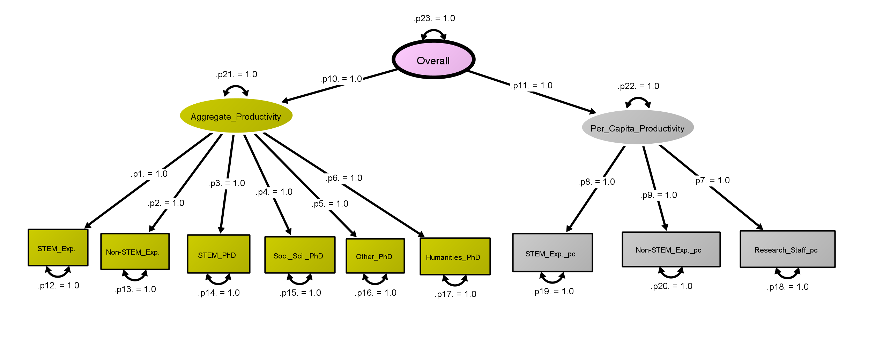
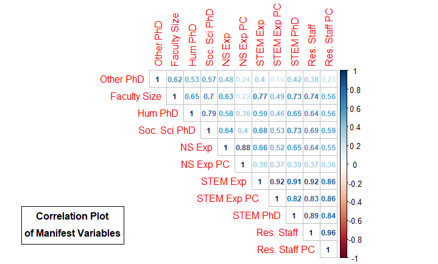
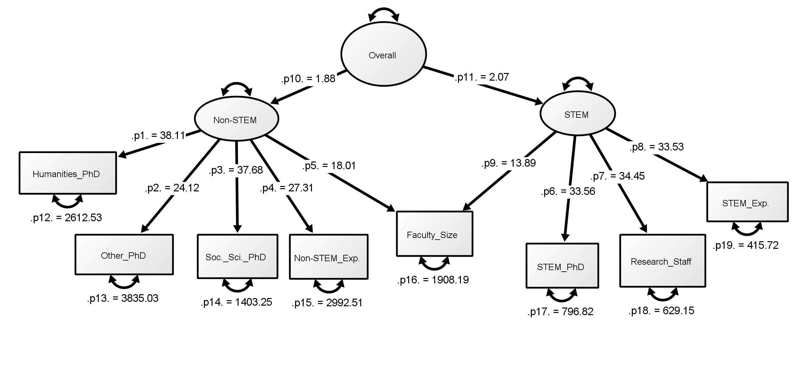
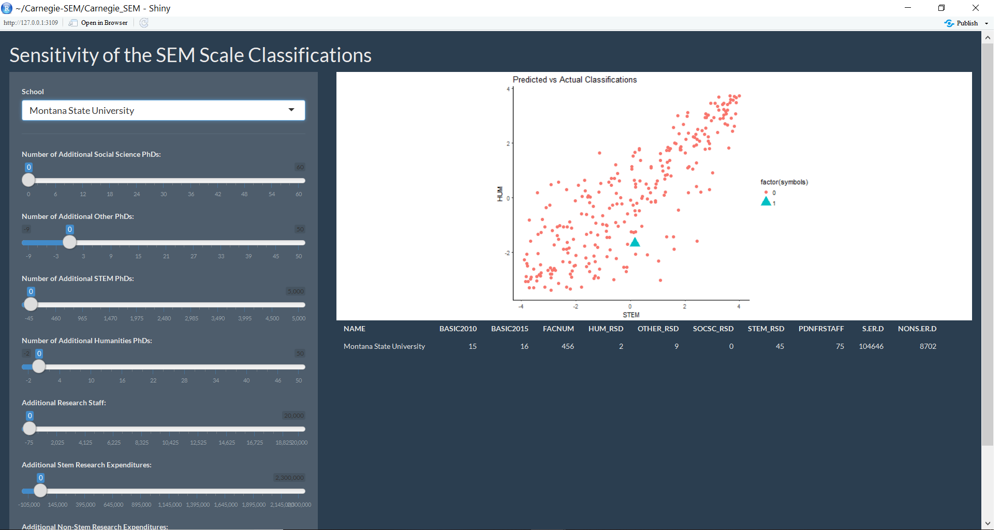

```{r setup, include=FALSE}
knitr::opts_chunk$set(echo = FALSE)
```

```{r, include = FALSE}


#read in data
#setwd("~/Carnegie-SEM/data")
cc2015 <- read.csv("CC2015data.csv",header = TRUE)

########2015################
cc2015.full <- read.csv("CC2015data.csv", header = TRUE, as.is = TRUE)
#updated file
#cc2015.full <- read.csv("Updated2015.csv", header = TRUE)

cc2015 <- cc2015.full[(cc2015.full$BASIC2015>14&cc2015.full$BASIC2015<18),]
cc2015$BASIC2015 <- factor(cc2015$BASIC2015)


#function for ranking the data
minrank <- function(x){rank(x, ties.method = "min")}

#dataset that we want to use
cc2015Ps<-
  na.omit(cc2015[,c("NAME","BASIC2010","BASIC2015","FACNUM","HUM_RSD",
                    "OTHER_RSD","SOCSC_RSD","STEM_RSD","PDNFRSTAFF","S.ER.D","NONS.ER.D")])

#calculate the ranked data
cc2015.r <- data.frame(cc2015Ps[,1:3],sapply(cc2015Ps[,-c(1:3)],minrank)) 

cc2015percap <- cc2015Ps[,c("PDNFRSTAFF","S.ER.D","NONS.ER.D")]/cc2015Ps$FACNUM


colnames(cc2015percap) <- c("PDNRSTAFF_PC", "S.ER.D_PC", "NONS.ER.D_PC")
#for Corrplot, nothing else


cc2015percap.r<-data.frame(sapply(cc2015percap,minrank))
cc2015_r <- cbind(cc2015.r, cc2015percap.r)
#RUN THIS FOR CORRPLOT: (commented out otherwise)
names(cc2015_r) <- c("Name","2010 Basic","2015 Basic","Faculty Size", "Hum PhD",
                     "Other PhD","Soc. Sci PhD", "STEM PhD","Res. Staff", "STEM Exp", 
                     "NS Exp", "Res. Staff PC", "STEM Exp PC  ", "NS Exp PC")

cc2015_matrix2 <- as.matrix(cc2015_r[-c(1:3)])
corrmatrix <- Hmisc::rcorr(cc2015_matrix2)

par(mar = c(1,.8,.8,2))
corrplot::corrplot(corrmatrix$r, order="hclust", type = "upper", method = 'number')
text(-4,3, 'Correlation Plot', font = 2)
text(-4,2,'of Manifest Variables', font = 2)
rect(-7,1.3,-1,3.5)

model4 <- '
HUMANITIES=~HUM_RSD+OTHER_RSD+SOCSC_RSD+NONS.ER.D+FACNUM
STEM=~STEM_RSD+PDNFRSTAFF+S.ER.D+FACNUM
Aggregate=~HUMANITIES+STEM'

model4 <- '
non-STEM = ~ Hum PhD + Other PhD + Soc. Sci PhD + 
STEM
'

library(lavaan)
lavaan_sem_new <- lavaan::sem(model4, data=cc2015_r, std.lv=TRUE,
                              orthogonal=FALSE, se="robust.huber.white")
lavaan::summary(lavaan_sem_new, standardized=TRUE, fit.measures=TRUE)
CCScores <- as.data.frame(lavaan::predict(lavaan_sem_new))
rownames(CCScores) <- cc2015Ps$NAME

#checks the standardized factor loadings
inspect(lavaan_sem_new, what = 'std')$lambda

#path diagram

source('https://raw.githubusercontent.com/brandmaier/onyxR/master/tools/install.R')
library(onyxR)
onyx(lavaan_sem_new)

library(beanplot)
beanplot(CCScores$Aggregate,log="",col="yellow",method="jitter")

library(mclust)
mcres<-Mclust(CCScores$Aggregate)
summary(mcres)

Classifications <- as.data.frame(mcres[14:15])
rownames(Classifications) <- cc2015Ps$NAME

table(mcres$classification, cc2015Ps$BASIC2015) ## pretty good!!

#Or more directly:
dens<-densityMclust(CCScores$Aggregate)
summary(dens)
par(mfrow=c(1,2))
plot(dens,what="diagnostic")

#Or clustering the STEM and HUMANITIES scores (bivariate version)
mcres2<-Mclust(CCScores[,1:2])


```


## Institutional Classifications
Systems for identifying like institutions, ranking universities, and delineating similar groups of peer-schools are used by students, faculty and administrators alike. They include:

+ The Carnegie Classifications for Higher Education
+ The US News World Ranking
+ Times Higher Ed

However, each one is subjective, and no perfect classifier exists. However, administrators use these to inform policy decisions (Montana State University, Idaho University), so it is useful to know how they work. 


## The Carnegie Classifications

The Carnegie Classifications delineate doctoral-granting institutions into three groups: 
+ R1: Very High Research
+ R2: High Research
+ R3: Moderate Research

Previously, they had been updated every five years. However, that has changed to a three year cycle in the future. Data are collected in a snapshot from IPEDS and other sources to be used in each update. 


## What Data are used?
Data used in the Carnegie Classifications are based on a snapshot from the Integrated Postsecondary Education Data System (IPEDS). The variables used in the classifications are:

+ STEM expenditures (in thousands of dollars)
+ Non-STEM expenditures (in thousands of dollars)
+ STEM PhD Counts
+ Humanities PhD Counts
+ Social Science PhD Counts
+ Nontenurable Research Staff size
+ Tenured/Tenure Track Faculty Headcount

## The Carnegie Methodology

+ **Rank** Institutions
+ **Index Creation**: PCA of aggregate and per-capita variables
+ **Plot the Indices**:  (per-capita vs aggregate)
+ **Create groups**:  (via line-drawing)

## Plot of the Carnegie Classifications
```{r}

```


## Principal Components Analysis 
Principal Componenents Analysis is a method for dimension reduction that takes a set of p predictor variables and decomposes it into k principal components that explain the most variation in the underlying variables. 


## Problems with Carnegie System
The process used by the Carnegie Classifications illustrates several problems:
+ **Based on Snapshot Data**: Data are based on a single snapshot rather than averages during the five-year period.  
+ **Changing Loadings**: Loadings can change yearly based on variability in the data. This has the potential to change which variables are most important in determining the aggregate and per-capita indices.  
+ **Dependence on Correlation**:  
+ **Group Determination**: The group determination is completely subjective. Lines are drawn after visual inspection of the plot (). 

\\
This causes problems for schools that try to direct policy based on these classifications because the most important variables can be different from release to release based on variability in the data. 


## Structural Equation Modeling

Structural Equation Models (SEM) are used to model simultaneous equations, the use of latent or unobserved variables, and variables to be measured with error. 

+ **Latent Variable Model**: Measures unobserved variables. 
+ **Measurement Model**: Relates the latent variables we are interested in to the manifest that we actually observe. 


## The Carnegie Method using SEMs

We can think of the Carnegie Classifications in a latent modeling framework using this path diagram: 



##Problems with the Carnegie Method for SEM:
The variables used to measure the aggregate and per-capita latent variables are literally the same (with a slight per-capita transformation). The SEM cannot handle this level of correlation in the two latent factors; it **does not converge** and thus paramaters cannot be estimated. 


## STEM and Non-STEM Factors: An Alternative
A more intuitive method would be to consider two latent factors:

+ STEM productivity 
+ Non-STEM productivity

Variables loaded onto these factors are not as likely to be correlated. 



##Proposed Model: STEM and Non-STEM



## Determining Group Membership
The SEM model returns a single factor-of-factor score for each university. These can be used as inputs to a clustering algorithm to determine both the optimal number of clusters and the optimal cluster membership. 

__Potential Problems__: 

+ Optimal Number of Clusters may be too large/small: We can fix this to a reasonable number if necessary (results here are fixed at 3). 
+ There are many different clustering methods to use (hierarchical clustering, mixture-model based methods, etc. )

## Group Membership with Mixture Model: 

Using a mixture model approach, we can obtain a solution with reasonable clusters. Additionally, we can account for/illustrate uncertainty in classification for schools near the boundary.

```{r plot_classifications}
Classifications <- mcres$classification
#creates a plot and colors by Carnegie Classification Colors  
    ggplot(CCScores_r_cov_new) + geom_point(aes(x = STEM, y = HUM, color = factor(Classifications), shape = factor(symbols), size = factor(symbols)))+ 
      ggtitle("Predicted vs Actual Classifications") + theme_bw() + coord_fixed(ratio = 1)+
      theme_classic() + 
      #theme(legend.position="right", legend.box = "vertical") + 
      labs(color = "Classification") 
    
```


## Shiny Applications: 
We developed shiny applications to assess sensitivity of both the Carnegie Classifications and the proposed SEM-Classifications for any institution of your choosing. 



## Conclusions

The SEM-based model allows for several benefits compared to the Carnegie Classifications: 

+ Latent variables do not have to be orthogonal like PCA-based indices
+ Latent variable modeling makes more sense than dimension-reduction (especially since we only have 7 variables)
+ Single-factor scores allow for comparison on a single dimension rather than using two scores.

## Future Work

Future work will focus on determining an optimal clustering strategy. The Carnegie Classifications themselves are changing, so if they change the variables that are used, we will investigate development of either a new latent trait or sensitivity of additional manifest variables to measure the STEM and non-STEM latent traits. 

##Questions:


